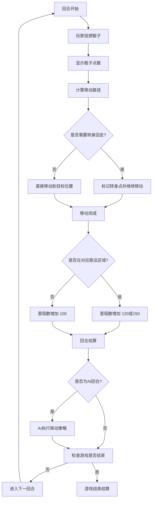

# 赛马桌游小游戏 - 产品需求文档

## 1. 产品概述
这是一款多人对战赛马桌游，玩家操控具有不同跑法特性的马匹，通过策略性的移动决策和骰子运气，在限定回合内竞逐最高里程数。游戏核心在于位置管理策略与跑法搭配，先实现人机PvE模式让玩家熟悉游戏机制。

## 2. 核心功能

### 2.1 用户角色
| 角色 | 描述 | 权限 |
|------|------|------|
| 玩家 | 游戏参与者 | 选择马匹、投掷骰子、决定移动策略 |
| AI对手 | 计算机控制的对手 | 自动进行策略决策和移动 |

### 2.2 功能模块
1. **游戏设置页面**：选择马匹跑法、设置总回合数、查看规则说明
2. **游戏主页面**：赛道可视化、骰子动画、回合信息、里程数显示
3. **结算页面**：显示最终排名、里程数对比、重新开始选项

### 2.3 页面详情
| 页面名称 | 模块名称 | 功能描述 |
|---------|---------|---------|
| 游戏设置页面 | 跑法选择 | 四种跑法卡片展示，每种跑法有独特的视觉设计和特性说明 |
| 游戏设置页面 | 回合设置 | 滑块或输入框设置总回合数（建议范围5-20回合） |
| 游戏设置页面 | 规则说明 | 简洁的游戏规则介绍，可展开/收起 |
| 游戏主页面 | 赛道区域 | 12个格子的可视化展示，清晰标注每种跑法的区域，马匹位置实时显示 |
| 游戏主页面 | 骰子区域 | 三面骰子的3D旋转动画，显示当前点数 |
| 游戏主页面 | 信息面板 | 当前回合/总回合、各马匹里程数、跑法提示 |
| 游戏主页面 | 操作按钮 | 投掷骰子、确认移动、回合结算等 |
| 结算页面 | 排名展示 | 以动画方式揭示最终排名和里程数 |
| 结算页面 | 操作选项 | 重新开始、返回设置、分享成绩 |

## 3. 核心流程

### 3.1 游戏启动流程
玩家进入游戏 → 查看四种跑法说明 → 选择自己的跑法 → 设置总回合数 → AI自动选择剩余跑法 → 游戏开始

### 3.2 回合流程

### 3.3 移动规则详解
- 赛道为环形或线性（根据设计决策）
- 三面骰子点数：1、2、3
- 移动方向：统一方向（顺时针或向右）
- 转身规则：当剩余步数超过可走格子数时，到达尽头后转身回走剩余步数

## 4. 用户界面设计

### 4.1 设计风格
- **主题色**：
  - 主色调：金黄色（象征赛马场的荣耀与活力）#F4A460
  - 辅助色：深棕色（代表赛道与马匹）#8B4513
  - 背景色：暖米色（营造温馨的桌面游戏氛围）#FAF0E6
  - 强调色：翡翠绿（代表草地与胜利）#50C878
- **按钮样式**：圆角矩形，带有3D立体效果，悬停时有下沉动画
- **字体**：
  - 标题：使用富有动感的字体（如 Playfair Display Bold）
  - 正文：清晰易读的字体（如 Noto Sans SC）
- **布局风格**：卡片式布局，顶部导航，中心游戏区域
- **图标/表情**：使用简约的马匹图标和跑法相关的图形元素

### 4.2 页面设计概览

| 页面名称 | 模块名称 | UI元素 |
|---------|---------|--------|
| 游戏设置页面 | 跑法选择卡片 | 渐变背景、马匹图标、跑法名称、特性描述、选中边框高亮 |
| 游戏设置页面 | 回合数选择器 | 滑块控件、数字显示、预设按钮 |
| 游戏主页面 | 赛道可视化 | 12个格子横向排列，每种跑法区域用不同颜色区分，马匹标记清晰可见 |
| 游戏主页面 | 骰子区域 | 3D骰子动画、点数显示、投掷按钮 |
| 游戏主页面 | 里程数面板 | 进度条、数字显示、实时更新动画 |
| 游戏主页面 | 回合信息 | 当前回合/总回合、跑法提示、操作指引 |
| 结算页面 | 排名展示 | 金银铜牌动画、里程数对比柱状图、获胜者高亮 |

### 4.3 响应式设计
- 采用桌面优先设计，保证游戏在大屏幕上的最佳体验
- 移动端自适应：赛道可滚动查看，按钮和文字大小适配触摸操作
- 关键信息在任何屏幕尺寸下都清晰可见

### 4.4 动画与交互
- 骰子投掷：3D旋转动画，带有音效提示
- 马匹移动：平滑的位置过渡动画
- 里程增加：数字滚动动画
- 回合切换：淡入淡出过渡
- 获胜展示：烟花或彩带动画效果

## 5. 跑法特性说明

### 5.1 逃（Front Runner）
- 描述：喜欢领跑的马，起跑后迅速占据前方位置
- 区域：赛道最前方的三个格子
- 里程奖励：在对应区域时 +120

### 5.2 先（Stalker）
- 描述：善于跟随的马，保持在前方集团但避免领跑
- 区域：赛道中前方的三个格子
- 里程奖励：在对应区域时 +150

### 5.3 差（Closer）
- 描述：后发制人的马，前期保存体力后期冲刺
- 区域：赛道中后方的三个格子
- 里程奖励：在对应区域时 +150

### 5.4 追（Chaser）
- 描述：善于追赶的马，从后方追赶超越对手
- 区域：赛道最后方的三个格子
- 里程奖励：在对应区域时 +120

## 6. AI策略设计（PvE模式）

### 6.1 AI决策逻辑
- 基础策略：优先停留在对应跑法区域
- 移动决策：根据骰子点数预测最终位置，选择最有利的位置
- 简单难度：随机移动，偶尔做出次优选择
- 中等难度：考虑当前位置与目标区域的距离
- 困难难度：预测玩家移动，采取竞争性策略

### 6.2 AI行为表现
- 思考延迟：模拟真实玩家的思考时间（1-2秒）
- 表情反馈：根据移动结果显示AI的情绪变化