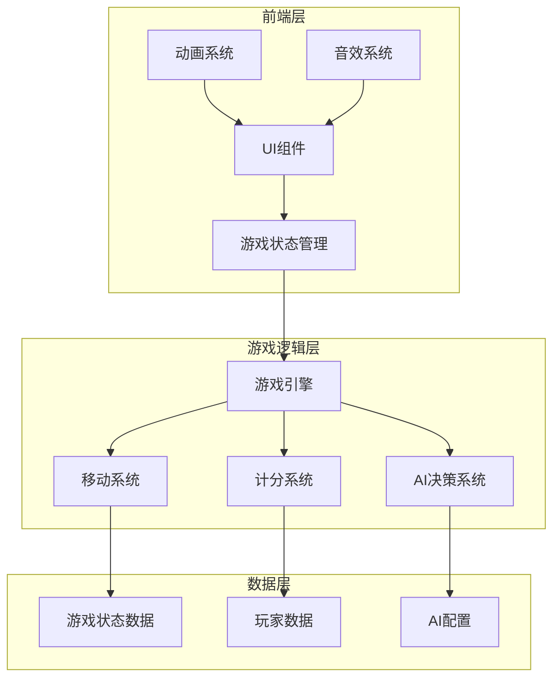
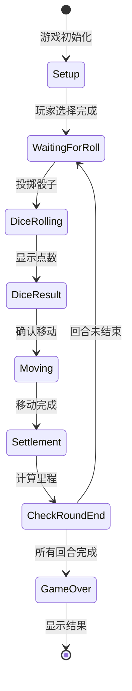

# 赛马桌游小游戏 - 技术架构文档

## 1. 架构设计



## 2. 技术说明

### 2.1 技术栈
- **前端框架**: React@18 + TypeScript
- **样式方案**: Tailwind CSS@3
- **动画库**: Framer Motion (用于流畅的动画效果)
- **构建工具**: Vite
- **状态管理**: React Hooks (useState, useReducer, Context)
- **后端**: 无 (纯前端应用，数据存储在本地)
- **数据持久化**: LocalStorage (保存游戏设置和历史记录)

### 2.2 核心技术决策
1. **纯前端实现**: 游戏逻辑完全在客户端运行，无需服务器支持
2. **组件化设计**: 每个游戏元素都是独立的可复用组件
3. **状态机模式**: 使用状态机管理游戏流程，确保逻辑清晰
4. **动画优先**: 使用Framer Motion实现流畅的游戏体验

## 3. 路由定义

| 路由 | 用途 | 组件 |
|------|------|------|
| `/` | 游戏设置页面 | SetupPage |
| `/game` | 游戏主页面 | GamePage |
| `/result` | 结算页面 | ResultPage |

## 4. 组件架构

### 4.1 页面组件
```
src/
├── pages/
│   ├── SetupPage/
│   │   ├── index.tsx              # 设置页面主组件
│   │   ├── RunningStyleCard.tsx   # 跑法选择卡片
│   │   ├── RoundSelector.tsx      # 回合数选择器
│   │   └── RuleExplanation.tsx    # 规则说明组件
│   ├── GamePage/
│   │   ├── index.tsx              # 游戏页面主组件
│   │   ├── RaceTrack.tsx          # 赛道组件
│   │   ├── DiceArea.tsx           # 骰子区域组件
│   │   ├── InfoPanel.tsx          # 信息面板组件
│   │   └── ActionButtons.tsx      # 操作按钮组件
│   └── ResultPage/
│       ├── index.tsx              # 结算页面主组件
│       ├── RankingDisplay.tsx     # 排名展示组件
│       └── ActionOptions.tsx      # 操作选项组件
```

### 4.2 共享组件
```
src/
├── components/
│   ├── common/
│   │   ├── Button.tsx             # 通用按钮组件
│   │   ├── Card.tsx               # 卡片组件
│   │   ├── Modal.tsx              # 模态框组件
│   │   └── Progress.tsx           # 进度条组件
│   └── game/
│       ├── Horse.tsx              # 马匹组件
│       ├── Dice.tsx               # 骰子组件
│       ├── TrackCell.tsx          # 赛道格子组件
│       └── MileageDisplay.tsx     # 里程数显示组件
```

## 5. 数据模型

### 5.1 数据模型定义

```mermaid
erDiagram
    Game ||--o{ Player : contains
    Game ||--|| GameConfig : has
    Player ||--|| RunningStyle : has
    Game ||--|| GameState : has

    Game {
        string id PK
        GameConfig config
        GameState state
        Player[] players
        int currentRound
        int totalRounds
    }

    Player {
        string id PK
        string name
        RunningStyle runningStyle
        int position
        int mileage
        boolean isAI
    }

    RunningStyle {
        string type "逃/先/差/追"
        int[] zonePositions "对应区域格子"
        int bonusMileage "奖励里程"
    }

    GameConfig {
        int totalRounds
        int playerCount
        Difficulty aiDifficulty
    }

    GameState {
        string phase "setup/playing/finished"
        string currentPlayerId
        int diceValue
    }

    enum Difficulty {
        EASY
        MEDIUM
        HARD
    }
```

### 5.2 TypeScript 类型定义

```typescript
// 跑法类型
type RunningStyleType = '逃' | '先' | '差' | '追';

// 跑法配置
interface RunningStyle {
  type: RunningStyleType;
  name: string;
  description: string;
  zonePositions: number[]; // 位置索引数组
  bonusMileage: number; // 奖励里程数
  color: string; // 主题色
  icon: string; // 图标标识
}

// 玩家数据
interface Player {
  id: string;
  name: string;
  runningStyle: RunningStyleType;
  position: number; // 0-11 表示在12个格子中的位置
  mileage: number;
  isAI: boolean;
  color: string;
}

// 游戏状态
interface GameState {
  phase: 'setup' | 'playing' | 'finished';
  currentPlayerId: string;
  diceValue: number | null;
  currentRound: number;
  totalRounds: number;
  players: Player[];
}

// 游戏配置
interface GameConfig {
  totalRounds: number;
  aiDifficulty: 'easy' | 'medium' | 'hard';
}

// 移动结果
interface MoveResult {
  playerId: string;
  startPosition: number;
  endPosition: number;
  diceValue: number;
  mileageGain: number;
  isInBonusZone: boolean;
}
```

## 6. 核心算法

### 6.1 移动算法
```typescript
// 伪代码示例
function calculateMove(currentPosition: number, diceValue: number): number {
  const trackLength = 12;
  let newPosition = currentPosition + diceValue;

  // 如果超过赛道长度，需要转身回走
  if (newPosition >= trackLength) {
    const excess = newPosition - (trackLength - 1);
    newPosition = trackLength - 1 - excess;

    // 如果回走后仍然小于0，继续向正方向走
    if (newPosition < 0) {
      newPosition = Math.abs(newPosition);
    }
  }

  return newPosition;
}
```

### 6.2 里程计算算法
```typescript
function calculateMileage(player: Player): number {
  const runningStyleConfig = getRunningStyleConfig(player.runningStyle);
  const isInZone = runningStyleConfig.zonePositions.includes(player.position);

  if (isInZone) {
    return runningStyleConfig.bonusMileage; // 120 或 150
  }

  return 100; // 基础里程
}
```

### 6.3 AI决策算法（中等难度）
```typescript
function aiDecision(player: Player, diceValue: number): number {
  const runningStyleConfig = getRunningStyleConfig(player.runningStyle);
  const targetZone = runningStyleConfig.zonePositions;

  // 计算可能的移动位置
  const possiblePositions = calculateAllPossiblePositions(player.position, diceValue);

  // 评估每个位置的得分
  const scoredPositions = possiblePositions.map(pos => ({
    position: pos,
    score: evaluatePosition(pos, player)
  }));

  // 选择得分最高的位置
  scoredPositions.sort((a, b) => b.score - a.score);
  return scoredPositions[0].position;
}

function evaluatePosition(position: number, player: Player): number {
  const runningStyleConfig = getRunningStyleConfig(player.runningStyle);
  let score = 0;

  // 如果在对应区域，加分
  if (runningStyleConfig.zonePositions.includes(position)) {
    score += runningStyleConfig.bonusMileage;
  } else {
    score += 100;
  }

  // 如果接近目标区域，略微加分
  const distanceToZone = calculateDistanceToZone(position, runningStyleConfig.zonePositions);
  score -= distanceToZone * 5; // 距离越远，分数越低

  return score;
}
```

## 7. 游戏流程状态机



## 8. 性能优化策略

### 8.1 动画性能
- 使用CSS transforms和opacity进行动画，避免触发重排
- 使用will-change属性优化动画性能
- 骰子动画使用requestAnimationFrame

### 8.2 状态更新优化
- 使用React.memo优化组件渲染
- 使用useCallback和useMemo减少不必要的重渲染
- 批量状态更新

### 8.3 资源加载
- 图片资源预加载
- 字体文件异步加载
- 关键CSS内联

## 9. 测试策略

### 9.1 单元测试
- 移动算法测试
- 里程计算测试
- AI决策逻辑测试

### 9.2 集成测试
- 完整游戏流程测试
- 多玩家场景测试
- 边界情况测试

### 9.3 UI测试
- 组件渲染测试
- 用户交互测试
- 响应式布局测试

## 10. 部署方案

### 10.1 构建配置
- Vite构建配置
- 环境变量管理
- 代码分割策略

### 10.2 部署方式
- 静态文件托管（如Vercel, Netlify, GitHub Pages）
- CDN加速
- 缓存策略配置